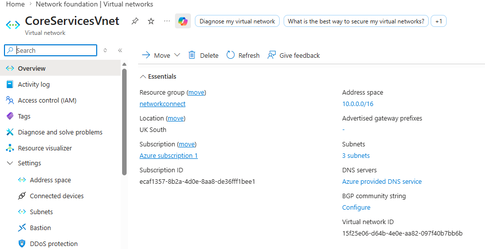
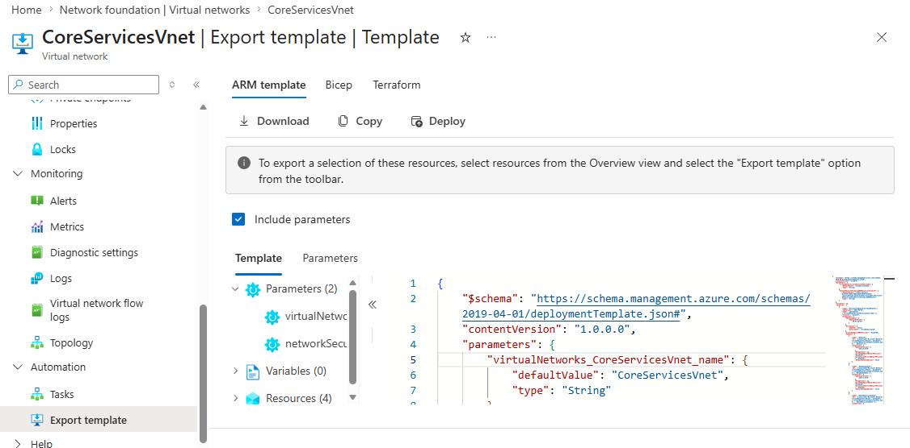
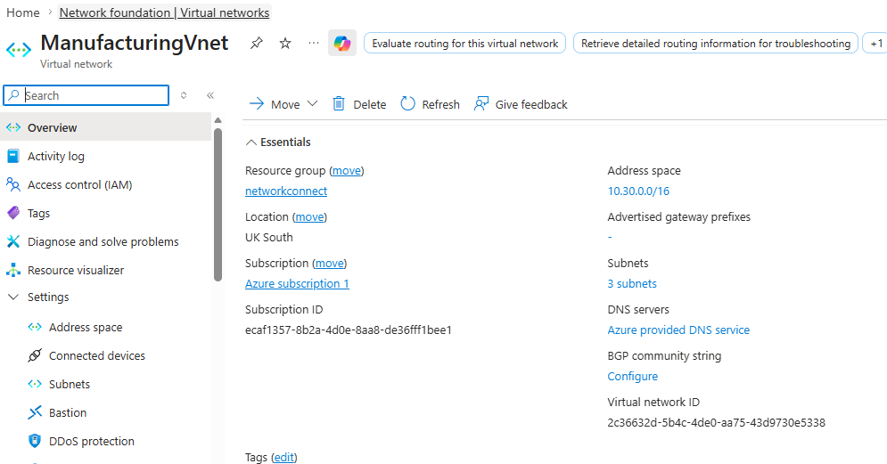
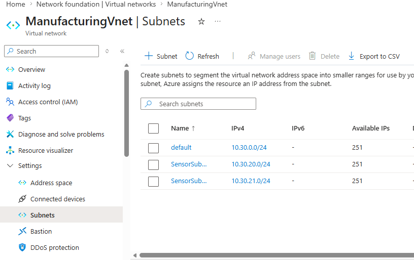
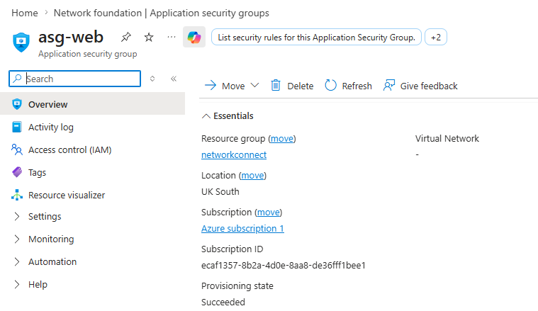
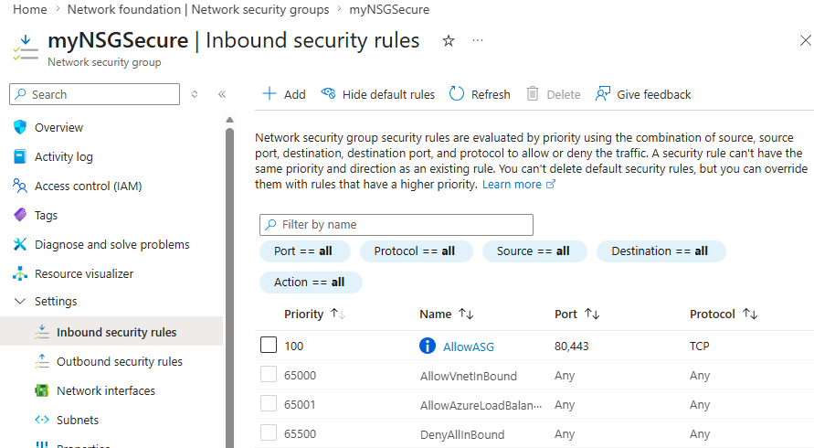
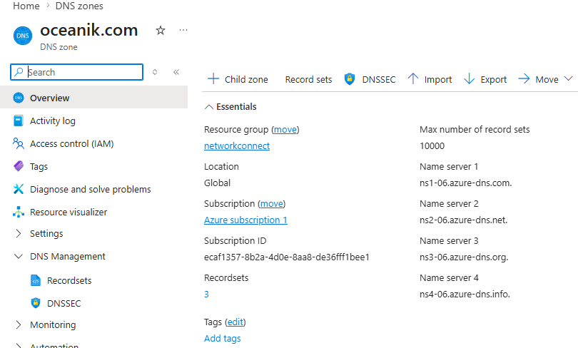
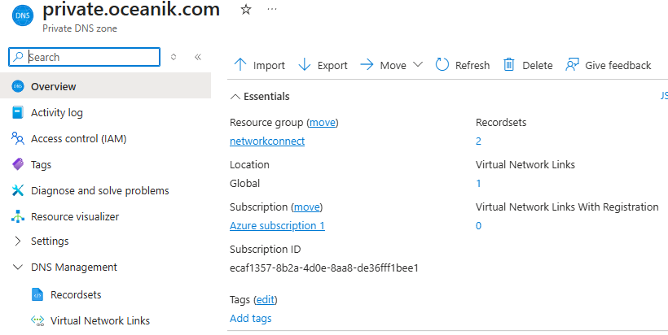
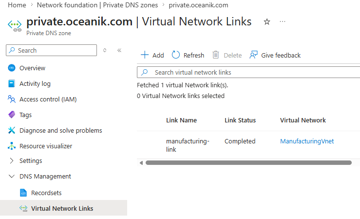

# Cloud Network Foundation Lab

A practical cloud networking lab built on Microsoft Azure, covering virtual networks, subnets, network security groups, application security groups, DNS zones, and private DNS - deployed in a live subscription.

---

## What This Lab Covers

| Area | Resource |
|---|---|
| Virtual Networks | CoreServicesVnet, ManufacturingVnet |
| Subnets | 3 subnets per VNet (default, SensorSubnet1, SensorSubnet2) |
| Network Security Groups | myNSGSecure with custom inbound rules |
| Application Security Groups | asg-web |
| Public DNS | oceanik.com (Azure DNS zone) |
| Private DNS | private.oceanik.com with VNet link |

---

## Architecture Overview

Two virtual networks were deployed into the `networkconnect` resource group in **UK South**, each with a `/16` address space segmented into `/24` subnets:

- **CoreServicesVnet** - `10.0.0.0/16`, 3 subnets.
- **ManufacturingVnet** - 10.30.0.0/16`, 3 subnets (default, SensorSubnet1 `10.30.20.0/24`, SensorSubnet2 `10.30.21.0/24`).

Both VNets use Azure-provided DNS by default, with private DNS resolution handled by a linked private zone.

---

## Resources Deployed

### Virtual Networks

**CoreServicesVnet**
- Address space: `10.0.0.0/16`
- Location: UK South
- 3 subnets configured
- ARM template exported for IaC reuse



**ManufacturingVnet**
- Address space: `10.30.0.0/16`
- Location: UK South
- Subnets: `default (10.30.0.0/24)`, `SensorSubnet1 (10.30.20.0/24)`, `SensorSubnet2 (10.30.21.0/24)`





---

### IaC Export

The CoreServicesVnet ARM template was exported directly from the portal, demonstrating infrastructure-as-code readiness. The template includes 2 parameters, 0 variables, and 4 resources. Available as ARM, Bicep, and Terraform.



---

### Network Security Group — myNSGSecure

Custom inbound security rules applied:

| Priority | Rule Name | Port | Protocol | Action |
|---|---|---|---|---|
| 100 | AllowASG | 80, 443 | TCP | Allow |
| 65000 | AllowVnetInBound | Any | Any | Allow (default) |
| 65001 | AllowAzureLoadBalancer | Any | Any | Allow (default) |
| 65500 | DenyAllInBound | Any | Any | Deny (default) |

The `AllowASG` rule uses an Application Security Group as the source, enabling tag-based traffic control rather than IP-based rules.



---

### Application Security Group - asg-web

- Location: UK South
- Resource group: `networkconnect`
- Provisioning state: Succeeded.
- Used as a source in the NSG `AllowASG` rule to permit web traffic on ports 80/443.



---

### Public DNS Zone - oceanik.com

Hosted on Azure DNS with 4 name servers assigned:

```
ns1-06.azure-dns.com
ns2-06.azure-dns.net
ns3-06.azure-dns.org
ns4-06.azure-dns.info
```

- Resource group: `networkconnect`
- Record sets: 3
- Max record sets: 10,000



---

### Private DNS Zone — private.oceanik.com

- Location: Global
- Record sets: 2
- Virtual Network Links: 1 (no auto-registration).



**VNet Link configured:**

| Link Name | Status | Linked VNet |
|---|---|---|
| manufacturing-link | Completed | ManufacturingVnet |

This allows resources inside ManufacturingVnet to resolve private DNS names in `private.oceanik.com` without exposing them publicly.



---

## Key Concepts Demonstrated

- Segmenting VNets into purpose-built subnets for workload isolation.
- Using ASGs inside NSG rules to avoid hard-coded IP ranges.
- Separating public DNS (internet-facing) from private DNS (internal resolution).
- Linking private DNS zones to specific VNets for scoped name resolution.
- Exporting ARM templates from live resources for IaC documentation.

---

## Technologies

`Azure Virtual Network` `Azure DNS` `Private DNS` `NSG` `ASG` `ARM Templates` `Bicep` `UK South`

---

## Related Portfolio Projects

- [Azure Cost Anomaly Alerter](#) — automated cost spike detection with Logic Apps and email alerts.
- [Azure IaC Bicep Deployment](#) — full environment provisioning via Bicep modules.
- [Cloud Infrastructure Toolkit](#) — reusable scripts and templates for cloud environments.
